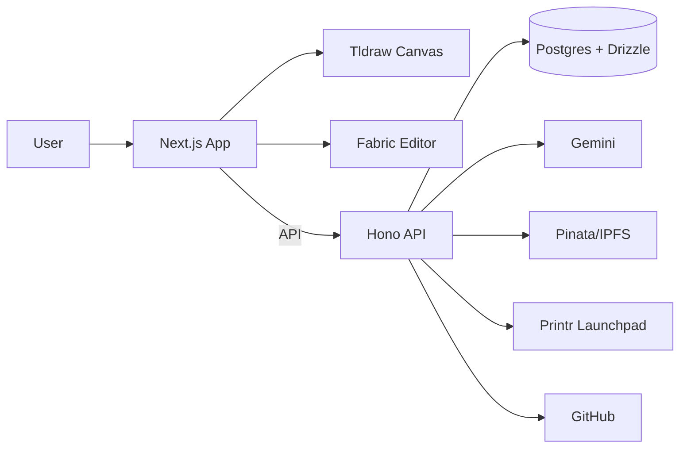
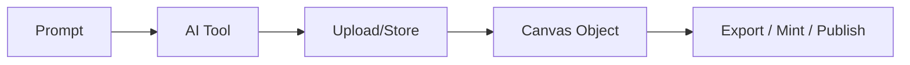

# Pigcasso Canvas

Pigcasso Canvas is an AI-native design workspace where prompts become assets on an infinite canvas, ready to export, mint, or publish. Slogan: "Canva ships files, we ship assets."

## What it does
- ChatCanvas (infinite canvas) powered by tldraw (`/canvas/*`).
- Classic editor powered by Fabric.js (`/editor/*`).
- AI generation: image, edit, HTML, and ideation chat.
- Web3 publishing: IPFS/NFT export and Printr Launchpad.
- Repository -> Asset: connect GitHub and generate assets from code.

## Architecture

### System overview


### Canvas generation flow


## Quickstart (local)
```bash
bun install
cp .env.example .env.local
DATABASE_URL=postgres://... bun run db:migrate
bun dev
```
Open `http://localhost:3000`.

### Minimal env for login + app
- `NEXT_PUBLIC_APP_URL`
- `DATABASE_URL`
- `NEXT_PUBLIC_PRIVY_APP_ID`
- `PRIVY_APP_SECRET`

See `.env.example` for optional integrations.

## Key routes
- `/` - Landing
- `/app` - AI-native Home (prompt -> new canvas)
- `/canvases` - Canvas list
- `/canvas/new` - New canvas
- `/editor/:projectId` - Classic editor
- `/repositories` - GitHub repo to asset

## Project structure
- `src/app/` - Next.js routes and layouts
- `src/features/` - domain modules (canvas, editor, projects)
- `src/components/` - shared UI
- `src/db/` - Drizzle schema and DB client

## Development commands
```bash
bun run lint
bun run typecheck
bun test
bun run build
```

## Deployment notes
- `vercel.json` forces Bun (`bun install --frozen-lockfile`, `bun run build`).
- `bun run build` runs `scripts/build.mjs`, which can apply migrations if `DATABASE_URL` is set.
- Production tldraw requires `NEXT_PUBLIC_TLDRAW_LICENSE_KEY`.
