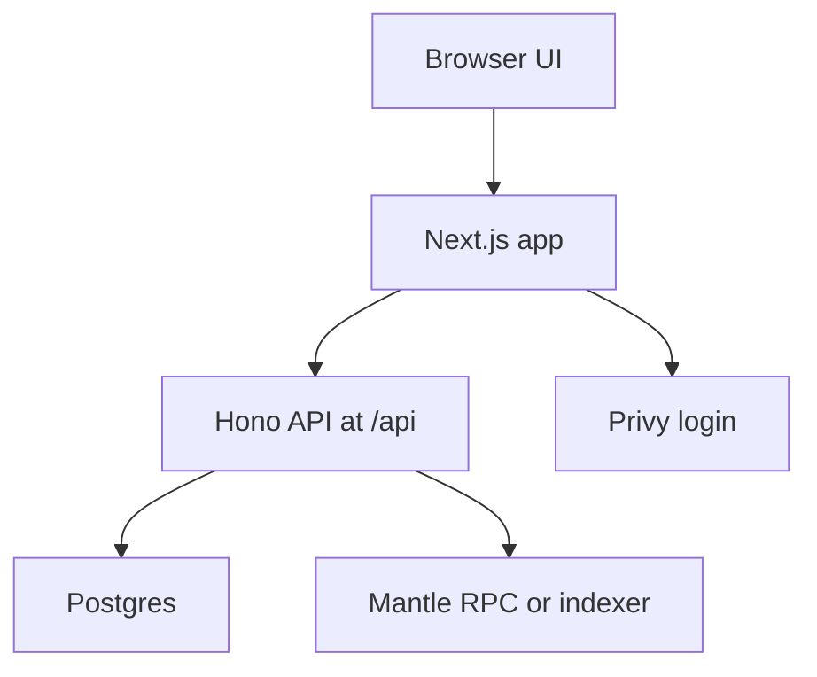

# Pigcasso Canvas — PRD

這個 repo 是 **Pigcasso Canvas**（Next.js + Fabric.js editor + Projects/Templates + Hono API + Drizzle/Postgres + Privy auth + Mantle token gating + UploadThing + Unsplash + Replicate/Gemini）。

更大的 thesis：**Canva 只是一個媒介**。我們要做的是 web3-native 的「next-generation Canva」：創作者完成創作後，內容應該能一鍵沉澱成可定價、可擁有、可交易的**內容資產**（例如：一鍵上鏈 NFT / 可追溯的 remix lineage / 可帶版權與分潤）。

---

## 0) 文件資訊

| 欄位 | 值 |
|---|---|
| 產品名稱 | Pigcasso Canvas |
| 版本 | v0.2（Hackathon MVP - revised for this repo） |
| 平台 | Web App（以此 repo 為基底） |
| 登入 | Privy（取代 NextAuth） |
| 帳號策略 | 預設 embedded wallet；若連結 external wallet，Pro 判定取兩者最大 balance；用量以 `privyUserId` 記帳 |
| Hackathon 鏈 | Mantle Mainnet（chainId=5000） |
| Pigcasso Token（CA） | `0xd38d6bbc92975501e6ba181262a3d3221dbbe640` |
| Token decimals | 18 |
| Pro 門檻 | `100000 * 10^18`（raw units） |
| 付款 | MVP 不做 pay-per-use；先做 token gating |
| RPC | Alchemy（RPC URL 由 env 提供） |
| Launchpad 整合 | Printr（先放 roadmap） |
| Bot | 不在範圍 |

---

## 0.1) Roadmap（V1 / V1.1 / V2）

### V1（現況已完成 / 可 demo）

- [x] Privy login（embedded wallet + external wallet）
- [x] Dashboard：Presets / Templates / Projects
- [x] Project create/open/remix UX（loading overlay + toasts）
- [x] Project rename（Editor 內改名）
- [x] Editor：Fabric.js（基本工具 + 自動存檔 + pack export）
- [x] Pigcasso Assistant（小豬助手、可拖拉、quick actions → Apply 到畫布）
- [x] Token gating：Mantle 上持倉解鎖 Pro（embedded/external 取最大值）
- [x] AI：Generate image / Remove BG（Replicate/Gemini provider + daily limits + 更清楚的錯誤訊息）
- [x] Settings：可更新 display name / avatar + AI 預設 provider（localStorage）

### V1.1（polish / 修洞）

- [x] Profile：新增「介紹 / bio」與更多個人設定（server-side persist）
- [x] Onboarding：專案建立 / remix / open editor 的過程更明確（loading overlay + toasts）
- [x] Assistant：LLM fallback（Gemini Pro，輸出 action JSON → human confirm → apply）
- [x] AI：provider fallback + 更清楚的 402/429/5xx 錯誤訊息（auto 時會嘗試切換 provider）
- [x] UploadThing：SDK v7+ token auth（`UPLOADTHING_TOKEN`）+ Avatar 上傳 UX（較大檔案上限 + 友善錯誤訊息）
- [ ] UploadThing：釐清 `prepareUpload 400 Unsupported operation`（可能是 token/appId 配對、plan/region 限制或專案設定）

### V2（Web3-native：內容資產 / 一鍵上鏈 NFT）

- [ ] Export as Asset：把 design（PNG + source JSON + metadata）打包成可上鏈資產
- [ ] NFT 管理頁面（Creator/Collector dashboard）
  - [x] `/nfts`：NFT 入口（Assets/Collections 統一資訊架構；目前 Coming soon）
  - [ ] `/nfts/assets/:id`：NFT 詳情（預覽、metadata、provenance、remix lineage、操作：view on explorer、refresh、re-mint）
  - [ ] `/nfts/collections/:id`（若採用 factory）：collection/series 詳情與管理
  - [ ] Mint 偏好設定：不分 Web2/Web3，整合在 `/settings`（Account / Preferences）
- [ ] IPFS：上傳 image + metadata + source（可選 pinning provider）
- [ ] One-click Mint：Editor 內一鍵鑄造 NFT（預設 Mint 到 Privy embedded wallet，可選 external）
- [ ] Provenance：creator / parent template / remix lineage 上鏈或可驗證（含 attribution）
- [ ] Royalties / licensing：版權條款、授權模式、royalty 設定（先 off-chain，再上鏈）
- [ ] Launchpad：把「一鍵 mint」延伸成 Pigcasso NFT launchpad / creator hub

---

## 1) 背景與問題

### 背景

- 我們擁有 Pigcasso（小豬 IP）與 Pigcasso meme token 生態。
- 我們想把 Pigcasso 從「迷因」升級成「Web3 團隊的設計助理」，讓社群可以快速產出大量且可用的素材（X/TG/Discord/Banner/Story/AMA）。

### 核心問題（Web3 社群的痛點）

- Web3 專案在 launch、campaign、日常營運需要 **高頻、多尺寸、多版本** 的素材。
- 只靠生成或 bot 不夠：最後 20% 的排版可讀性、安全區、元素位置與平台尺寸適配必須在畫布上完成。
- 現有 Canva 是 Web2：身份、付費、分潤不是 web3-native；我們要把「創作工具」做成「web3 社群的創作基建」，可延伸到 creator economy。

---

## 2) 產品目標（Goals）與成功指標

### Hackathon MVP 目標（必達）

1. **Web3-native login**：Privy 登入，支援 email/社交，並提供 embedded wallet 或連結 external wallet。
2. **移除 Stripe/Web2 payment**：repo 內所有 Stripe 訂閱、帳單、upgrade flow 全部移除。
3. **Pro = Token gating**：以 Mantle mainnet 上的 Pigcasso token 持倉解鎖 Pro（門檻 `100000e18`）。
4. **Pigcasso Design Assistant（Chat + Actions）**：右下角小豬聊天室能理解指令並「直接對畫布做排版/編輯」（不是只聊天）。
5. **Web3 Presets + Pack**：至少 3 種 preset，Pro 可一鍵輸出多尺寸 pack（至少 3 種）。
6. **Creator Hub Seed**：作品可存為 Template/Kit、可分享、可 Remix，並保留 creator attribution 與 parent 指標。

### 成功指標（Hackathon demo）

- 新用戶從進站到完成第一張可用素材：<= 60 秒（理想）/ <= 120 秒（可接受）
- Token gating 能正確顯示 Pro/Free（含錯誤提示與重試）
- Demo 可展示：同一個內容一鍵輸出多平台尺寸（至少 3 種）

---

## 3) 非目標（Non-goals / Not now）

- 任何 Web2 付款（Stripe、信用卡、Web2 訂閱）
- x402（放 roadmap）
- Onchain 分潤合約 / 自動結算（放 roadmap）
- TG/X/Discord bot（明確不做）
- 完整 marketplace（上架、購買、評價）MVP 只做入口或展示雛形

---

## 4) 目標用戶（Personas）

1. Web3 社群小編 / Growth：高頻、快、可讀性高、多尺寸輸出
2. Launchpad / 專案方（Printr 生態）：一鍵生成 launch kit（公告、教學、AMA 活動、banner 等）
3. Creator / Designer：模板可 remix、可歸因，未來可分潤

---

## 5) 既有 repo 現況（用來對齊實作）

> 本段是原 PRD 缺少但對工程決策很關鍵的 repo context。

### 目前已存在的能力（可直接復用）

- Fabric.js 編輯器（形狀、文字、圖片、濾鏡、繪圖、Undo/Redo、自動存檔）
- Projects/Template 的 DB model（`project` 表含 `json/width/height/thumbnailUrl/isTemplate/isPro`）
- Hono API mounted at `/api/*` + typed client（`src/lib/hono.ts`）
- UploadThing（可用於上傳素材/縮圖）
- Unsplash（可作背景素材來源）
- Replicate（有 `generate-image` 與 `remove-bg` endpoint）

### 目前「會衝突」且需要改動的地方

- Auth：現用 NextAuth v5（`src/auth.ts`、`src/auth.config.ts`）+ Hono `verifyAuth()`；PRD 要改成 Privy。
- Pro gating：現用 Stripe subscription + `usePaywall()`；PRD 要改成 Mantle token gating。
- Stripe：`src/app/api/[[...route]]/subscriptions.ts`、`src/lib/stripe.ts`、`src/features/subscriptions/*` 等需要移除。

---

## 6) MVP User Journey（端到端）

### Flow A：Free

1. 開網站 -> Login with Privy
2. 登入後進 Dashboard（看到 Web3 Presets）
3. 選一個 preset（例如 TG Announcement）
4. 進 Editor -> 右下角小豬聊天：
   - 使用者描述需求（例：幫我做一張 AMA Post，標題 XXX，時間 XXX，置中排版，偏 neon）
   - Assistant 產生排版並落到畫布（可編輯物件）
5. 微調 -> Export PNG

### Flow B：Pro（持幣門檻達標）

同 Flow A，但解鎖：

- 一鍵輸出多尺寸 Pack
- Pro templates / Pro vibes（少量即可）
- 進階 variants（例如一次 6 個）

### Flow C：Template 分享與 Remix

1. 使用者把作品 Publish 成 Template
2. 產生 share link
3. 另一個使用者打開 link -> Remix（複製到自己的 project）
4. 顯示 attribution：Created by / Remixed from

---

## 7) 功能需求（MVP Scope）

### 7.1 Auth：Privy 登入（Must）

需求：

- 用 Privy 取代 NextAuth。登入後需要拿到：
  - `privyUserId`
  - 至少一個 `walletAddress`（embedded 或 external）
- MVP 簡化策略：
  - 預設使用 embedded wallet（Privy UX 最順）
  - 若 user connect external wallet：Pro 判定採「embedded vs external」兩者取最大 balance（不做更複雜的多 wallet 聚合/跨帳號偵測）
  - AI 用量記帳以 `privyUserId + UTC date`（避免切換 wallet 逃避限制，也更符合 UX）
- UI：
  - 未登入：可看 landing 或 preset 預覽；點 Create 會要求登入
  - 已登入：顯示 wallet 縮寫與 Pro/Free badge

工程落點（與此 repo 對齊）：

- 目前 API 多用 `verifyAuth()`，但它是基於 Auth.js；Privy 上線後需要替換成「Privy token verification middleware」並把 user context 注入 Hono `Context`。
- 建議新增 `/api/me`（或在每個 API response 帶上）回傳目前登入與 Pro 狀態，讓前端初始化更順。

### 7.2 移除 Stripe / Web2 Billing（Must）

需求：

- 移除所有 Stripe subscription、checkout、webhook、billing page、upgrade button。
- 所有「原本會打開 subscription modal 的地方」改成 token gating 文案或連到「如何取得 Pigcasso token」。

工程落點：

- 目前 repo 的 Pro gating 主要在 UI：`usePaywall()` + subscription modal。這會改成 `useTokenGating()`（或 `usePro()`）並且 Pro-only server endpoint 要做 server-side check（避免只靠 UI 擋）。

### 7.3 Token gating：Pigcasso Pro（Must）

判定規則（MVP 寫死）：

- chain：Mantle Mainnet（chainId=5000）
- token：`0xd38d6bbc92975501e6ba181262a3d3221dbbe640`
- decimals：18
- `max(balanceOf(addresses)) >= 100000e18` -> Pro（raw units）
  - `addresses` 來源：embedded wallet +（若有）external wallet
  - 只取「最大值」，不把多個 wallet 的 balance 相加（避免複雜度暴增）

需求細節：

- 顯示狀態：
  - Pro：顯示 “Pigcasso Pro unlocked”
  - Free：顯示「持有 Pigcasso token >= 100000 解鎖 Pro」
- 快取：
  - 建議 server-side cache（例如 DB 欄位或 KV）+ TTL（例如 5-15 分鐘）
  - UI 進站查一次，並提供手動 refresh
- 失敗 UX：
  - RPC/indexer 掛了：顯示「暫時無法驗證持倉，請稍後重試」並 fallback 為 Free

安全性要求：

- **Pro-only 行為不可只靠前端**（例如 Pro templates、AI 端點、Pack export）：server 也要驗證 Pro，避免直接呼叫 API bypass。

### 7.4 Pigcasso Design Assistant（Chat + Actions）（Must）

定位：差異化 MVP，不是「只出圖」，而是「把 web3 素材排版/編輯落到畫布上」，並能用聊天指令快速完成最後 20% 的設計工作。

#### 7.4.1 UI（最小可用）

- 右下角固定一隻 Pig（chat bubble + panel）
- Chat 模式支援：
  - 自然語言輸入（中文為主）
  - Quick actions（chips）：`置中` / `對齊` / `做一張 AMA` / `產生 3 個版本` / `換 vibe`
  - 「套用到畫布」需明確按鈕（避免誤觸改掉整張圖）

#### 7.4.2 能力範圍（MVP 要做哪些 actions）

MVP 先做「高頻、可穩定落地」的編輯/排版操作（全部都必須落成 Fabric 可編輯物件）：

- 物件對齊/排版：
  - 對齊畫布：置中、置頂、置底、左右對齊
  - 對齊選取物件：左/中/右對齊、等距分布（如來不及可先做「置中」）
  - 文字層級：自動調整 Title/Sub-title/CTA 字級與字重（基於規則）
- 常用 Web3 素材版型（規則化模板）：
  - AMA Post（title + datetime + CTA）
  - Announcement Post（title + subtitle）
  - Event Banner（16:9 版型）
- Variants：
  - 一鍵生成 3 種版型（centered / split / diagonal）並讓使用者點選套用

#### 7.4.3 生成內容（AI）與用量策略

MVP 保留「現有 repo 的 AI 能力」，但改成符合你想要的分級：

- Remove BG：
  - Free：每日 5 次（server-side 記帳與限流）
  - Pro：較高額度或不限（建議先用 env 可調）
- Generate Image：
  - Free：每日 5 張（server-side 記帳與限流）
  - Pro：較高額度或不限（可先設為不限）

> 用量計數建議以「privyUserId + UTC date」為 key，在 Postgres 記錄每日使用量，避免 client 竄改與切換錢包繞過限制。

#### 7.4.4 Provider 策略：Replicate + Nano Banana 並存（User 可選）

現況：repo 已接 Replicate，`/api/ai/generate-image` 用的是 `stability-ai/stable-diffusion-3`。

MVP 目標：同時保留 Replicate 的穩定性，並引入 Gemini「nano banana」作為更強的 image editing 選項；由使用者在 UI 選 provider（預設 Replicate）。

Provider 規劃：

- Generate Image：
  - Replicate（預設、最省改動）
  - Gemini nano banana：`gemini-2.5-flash-image-preview`（更擅長一致性與編輯/合成）
- Remove BG：
  - Replicate rembg（預設、最穩定）：`cjwbw/rembg:*`
  - Gemini（可選、偏實驗）：以 image edit 方式要求輸出透明背景（品質可能受 prompt/素材影響）

Trade-offs（簡述）：

- Replicate
  - 優點：現成整合、可控、對 remove-bg 這種「工具型模型」更穩定
  - 缺點：生成品質/一致性取決於模型；對複雜「多圖融合/設計感改造」未必最強
- Gemini nano banana
  - 優點：更擅長 image editing / multi-image compose / 一致性；很貼近「把素材修成設計可用」的需求
  - 缺點：需要 `GEMINI_API_KEY`（多半需 paid tier）；要新寫 server adapter；配額與政策風險較高

工程建議：

- 做一層 provider abstraction（server），並在 API request 加 `provider` 欄位（或 query）
- UI 預設選 Replicate；若缺少 `GEMINI_API_KEY` 則自動隱藏 Gemini 選項
- 若 Gemini 的 remove-bg 效果不穩，UI 標註為 Experimental，並保留 Replicate 作為預設/保底

> 重要：不管用哪個模型，AI 只負責「出素材」；排版/安全區/可讀性仍由規則化 layout + Editor actions 保證。

#### 7.4.5 Pigcasso Brand Baseline（v0）

> 先用你提供的 logo/visual 建一套 baseline，後續你給更完整 brand kit 再精修。

- 色彩（建議）
  - Pig Pink（Primary）：`#F7A9B8`
  - Neon Cyan（Accent）：`#25D6FF`
  - Soft Peach（Background）：`#FBE9E8`
  - Graphite（Text/Ink）：`#111827`
  - Metal Gray（UI Chrome）：`#6B7280`
  - Paint Pops（可選點綴）：Yellow `#F7D74A` / Magenta `#FF4D8D` / Lime `#7CFF6B`
- 風格語彙
  - 「可愛 + 科技感」：圓角、柔和底色、局部 neon glow（不要整頁都霓虹）
  - 背景常用：`Soft Peach → Pig Pink` 的淡漸層；內容卡片用白底/淡灰
  - 插畫元素：機械零件線條 + 油漆潑墨作為 accent
- 字體（MVP 先簡化）
  - UI：沿用 repo 預設 sans（後續如需可改成 Inter / Space Grotesk）
  - 模板：Title 用 Bold、Body 用 Regular；避免太多字體混搭

### 7.5 Web3 Presets + Pack（Must / Pro）

Presets（MVP 至少 3 種，先用業界常見尺寸；之後可再調）：

| Preset | 尺寸（px） | 用途 | Safe area（建議） |
|---|---:|---|---|
| X Post (4:5) | 1080 x 1350 | 主視覺/公告/AMA | 96px 邊距 |
| TG Announcement (1:1) | 1080 x 1080 | TG 公告圖 | 80px 邊距 |
| Discord Event Banner (16:9) | 1920 x 1080 | 活動 banner | 120px 邊距 |

Pack（Pro 解鎖）：

- 一鍵輸出多尺寸（至少 3 種）
- 匯出形式（兩種都要有）：
  - Download as ZIP（建議預設）
  - Download as separate files（fallback / 也可直接選）
- Safe area 適配（MVP 可先用簡單規則）：
  - 置中
  - 固定邊距
  - 文字層在安全框內縮放或換行
- MVP 建議演算法（好落地、可 demo）：
  - 以「所有可見物件的 bounding box」算出整體內容框
  - 對每個 preset 的 safe area 做「等比縮放 + 置中」把整體內容框塞進去
  - 文字若 overflow：先縮字級（或改多行），仍不行才截斷（避免崩版）

工程落點（與 repo 對齊）：

- 目前 export 在 `src/features/editor/components/navbar.tsx`（PNG/JPG/SVG/JSON）。
- Pack export 需同時支援「連續下載多個 PNG」與「zip 一包下載」。
  - 檔名建議：`{projectName}_{presetKey}_{width}x{height}.png`（例如 `ama_x_1080x1350.png`）

### 7.6 Creator Hub（MVP 做歸因與 Remix 種子）

MVP 不做付費與分潤，只做：

- 使用者可把 project Publish 成 Template/Kit
- Template metadata（至少）：
  - creator wallet
  - createdAt
  - parentTemplateId（若是 remix）
- Share link：
  - 他人打開 link 會先走 Privy login，登入後才可 Preview/Remix（MVP 先把所有互動放在 auth 後）
- 顯示文案：
  - Created by 0x...
  - Remixed from ...

資料模型建議：

- 目前 templates 其實是 `project.isTemplate=true`；建議擴充 `project` 加上 `isPublicTemplate`、`parentProjectId`、`creatorWallet` 之類欄位，或新增一張 `templates` 表（視工期選最短路徑）。

### 7.7 Launchpad 整合（Printr）（Roadmap）

Hackathon MVP 先不做 Printr；只在 roadmap 保留「Launch Kit/Pack manifest」的概念與命名規則，避免後續重構。

---

## 8) 技術設計（MVP）

> 這一節把「如何在此 repo 上落地」講清楚，避免 PRD 停留在概念層。

### 8.1 系統架構（延用 repo 既有形狀）

- 前端：Next.js App Router + React Query
- 後端：Hono 掛載在 Next Route Handler（`/api/*`）
- DB：Drizzle + Postgres

### 8.2 Auth from NextAuth to Privy（最短落地路線）

目標：所有 server-side 與 Hono API 都能可靠辨識「這個 request 是誰」以及「他的錢包地址」。

建議做法：

- Client：
  - 用 Privy 提供的登入 UI
  - 取得可用的 access token 或 session token
  - 呼叫 Hono API 時帶 `Authorization: Bearer <token>`
- Server：
  - 在 Hono middleware 驗證 token（Privy server verification）
  - 取出 `privyUserId` 與 `walletAddress`
  - 對 DB 做 upsert：若第一次登入就建立 user；若 wallet 有變動就更新

> 這樣可以把「身份」從 NextAuth cookie，切到 Privy token，而不需要在 Hono 端依賴 Auth.js 的 `verifyAuth()`。

### 8.3 Token gating（server-side 計算與快取）

原則：**不要相信 client 自己算的 Pro**，所有 Pro-only server endpoint 要由 server 判斷。

建議落地：

- 以 Mantle RPC 呼叫 ERC20：
  - `decimals()`（可快取）
  - `balanceOf(address)`（最多查 embedded + external 兩個）
- 計算：
  - 把 raw balance 換算成人類單位（或直接用 raw units 比較，視你決定）
- 快取：
  - 建議以 `privyUserId + tokenAddress + chainId` 為 key（同一個 user 可能有 embedded + external）
  - TTL 建議 5-15 分鐘，並提供 manual refresh

### 8.4 Pro enforcement（避免繞過 UI）

目前 repo 的 Pro gating 大多在前端（例如 templates/AI），API 本身沒有防護。MVP 要補上：

- 新增 `requirePro` middleware（Hono）
- 在以下路徑至少加上 server-side Pro check：
  - Pro templates 的「取得 json」或「套用」行為
  - Pack export 相關的 server 行為（若有）
  - AI endpoints（如果保留 Replicate：generate/remove-bg）

### 8.5 Data Model（建議最短改動）

現有 schema 已有 `project.isTemplate/isPro/thumbnailUrl`，可用最小 schema 變更支撐 Creator Hub：

- `user`（新增欄位）
  - `privyUserId`（unique）
  - `walletAddress`（primary address）
- `project`（新增欄位，或新增 template 表）
  - `isPublicTemplate` boolean（default false）
  - `creatorWallet` text（publish 當下寫入，避免之後 user 改錢包）
  - `parentProjectId` text nullable（remix lineage）
  - `publishedAt` timestamp nullable

> 如果你希望更乾淨，可新增 `templates` 表，但 MVP 最短路徑是擴充 `project`。

### 8.6 API surface（MVP 建議）

建議新增：

- `GET /api/me`：回傳登入狀態、walletAddress、pro 狀態與快取資訊
- `POST /api/token-gating/refresh`：手動刷新 balance（選做，但 UX 會好很多）
- `POST /api/projects/:id/publish-template`：把 project publish 成 public template
- `GET /api/templates`：列出可用 templates（MVP 需登入；可含 isPro，但對 free 不回傳 pro 的 json）
- `GET /api/templates/:id`：取得 template json（MVP 需登入；若 template.isPro 則 requirePro）
- `POST /api/templates/:id/remix`：建立新 project，並寫入 parentProjectId

建議移除：

- `/api/subscriptions/*`（Stripe webhook/checkout/billing 等全部下線）

### 8.7 縮圖與 template preview（建議納入 MVP）

這個 repo 的 templates UI 依賴 `thumbnailUrl`，但目前沒有自動生成流程。建議：

- Publish template 時，從 canvas 產一張縮圖（PNG）-> 上傳到 UploadThing -> 寫回 `project.thumbnailUrl`
- 這樣 Dashboard/Editor template list 才能穩定展示

### 8.8 環境變數（新增）

除既有 `.env.example` 外，MVP 需要補：

- `NEXT_PUBLIC_PRIVY_APP_ID`
- `PRIVY_APP_SECRET`（server）
- `MANTLE_RPC_URL`（Alchemy RPC URL）
- `MANTLE_CHAIN_ID=5000`
- `PIGCASSO_TOKEN_ADDRESS=0xd38d6bbc92975501e6ba181262a3d3221dbbe640`
- `PIGCASSO_TOKEN_DECIMALS=18`（可選，亦可鏈上讀）
- `PIGCASSO_PRO_THRESHOLD_RAW=100000000000000000000000`（100000e18）
- `GEMINI_API_KEY`（若採用 nano banana / Gemini provider）
- `AI_PROVIDER_DEFAULT=replicate`（或 `gemini`；可選）

---

## 9) 權限與 Pro 功能（建議最小集合）

Free（建議）

- 基礎 editor 全開（降低上手阻力）
- 可使用 presets + 單一尺寸匯出
- Assistant Generate Layout（可選擇性加上每日次數限制）

Pro（持幣 >= 100000）

- 多尺寸 Pack 匯出
- Pro templates / Pro vibes（少量即可）
- 批量 variants（例如一次 6 個）或 AI 能力（如果保留 Replicate）

---

## 10) Roadmap（Hackathon 後）

### One-click NFT / Content Asset

- 在 Editor 提供「Export → Mint」流程：輸出 PNG/JPG、source JSON、metadata（含尺寸、安全區、vibe、prompt 等）
- IPFS 上傳與 pinning 策略（自建 pinning / 第三方 pinning / 使用者自帶 pinning key）
- Mint 合約策略（ERC-721 vs ERC-1155、metadata schema、royalties、是否允許 remix-derivative）
- 合約架構建議：Factory + minimal proxy（EIP-1167 clones）
  - `CollectionFactory`：建立 collection（每個 creator/brand 一個 collection 或共用一個 collection）
  - `Collection`：ERC-721（先 1/1）+ minter role +（未來）EIP-2981 royalties
- Gas 策略（使用者付費 vs paymaster 贊助；Privy embedded wallet 的 UX 與風險）
- 設計資產的權利與授權（template / remix / 商用 / 署名 / 分潤）

### Web3 付款

- x402 / pay-per-use：放 roadmap（等 Mantle 生態與支付條件成熟）

### 分潤

Phase 1（較輕）：

- Off-chain 記帳（usage events）+ creator dashboard
- 先把「歸因、使用次數、被 remix 次數」做成資料基礎

Phase 2（上鏈）可選方向（擇一）：

- Onchain registry + offchain payouts
- Onchain split payment
- Template license NFT

### Printr Launch Kit

- 定義 launch kit 的 pack manifest（尺寸、檔名、用途、文案欄位）
- 與 Printr 的「專案資料」對接（例如自動帶入 ticker、時間、連結）

---

## 11) Hackathon Demo Script（建議）

1. 進站 -> Privy 一鍵登入（展示 web2 級 UX）
2. 顯示 wallet address + Pro badge（用持幣錢包或測試錢包）
3. 點 Web3 Presets
4. 在 Pigcasso Panel 填 ticker + CTA + vibe
5. 生成 3 個 variants -> 套用一個
6. Pro 一鍵輸出 X + TG + Discord 三種尺寸
7. Share link，另一個錢包打開 -> Remix（Creator Hub 雛形）

---

## 12) Definition of Done（MVP 交付清單）

- [ ] Privy login 可用，登入後可取得 wallet address
- [ ] Stripe 完全移除（無 checkout、無 webhook、無 billing）
- [ ] Token gating：Pigcasso balance >= 100000 -> Pro（含快取與錯誤 UX）
- [ ] Token gating：embedded + external（若有）取最大 balance（不做加總）
- [ ] Editor 內有 Pigcasso Assistant Panel（Generate Layout + 3 variants）
- [ ] 至少 3 個 Web3 Presets
- [ ] Pro：一鍵輸出多尺寸 pack（至少 3 種），同時支援 ZIP 與 separate files
- [ ] Template 可 publish/share + Remix，帶 creator attribution + parent 指標
- [ ] Pro-only server endpoints 有 server-side enforcement（不只 UI）
- [ ] AI 用量限制：Free（Generate 5/day、Remove BG 5/day），Pro 額度可調；並支援 provider 選擇（Replicate/Gemini）

---

## 13) 建議實作順序（讓團隊可以直接開工）

1. 砍 Stripe（刪 UI + endpoints + lib）→ 確保 app 仍可跑通核心流程
2. 上 Privy（登入 UI + server token verify middleware）→ 取到 `walletAddress`
3. 做 token gating（server-side + 快取 + `/api/me`）→ UI 顯示 Pro/Free
4. Assistant MVP（右下角 panel + rule-based actions + 3 variants）→ demo 核心差異化
5. Presets + Pack export（至少 3 尺寸 + 一鍵輸出）→ demo「多平台素材管線」
6. Creator Hub seed（publish/share/remix + attribution）→ demo web3-native remix

---

## 14) Decision Log（已對齊）

- Privy：預設 embedded wallet；external wallet 可選連結；Pro 判定取兩者最大 balance
- Pack export：同時提供 ZIP 與 separate files（ZIP 失敗則可 fallback）
- Vibe：先用 `Pigcasso Brand Baseline（v0）` 作為模板與 UI baseline
- AI 用量：Free（Generate 5/day、Remove BG 5/day）；Pro 額度可調
- AI provider：Replicate + Gemini nano banana 並存，讓使用者選 provider（預設 Replicate）
- Template hub：所有互動都要求 Privy login（free mode 也一樣）
- Printr：放 roadmap（MVP UI 不出現）
