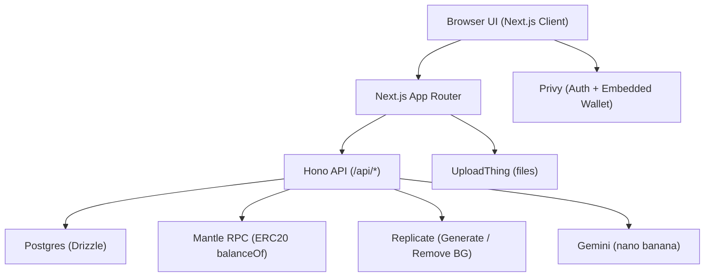
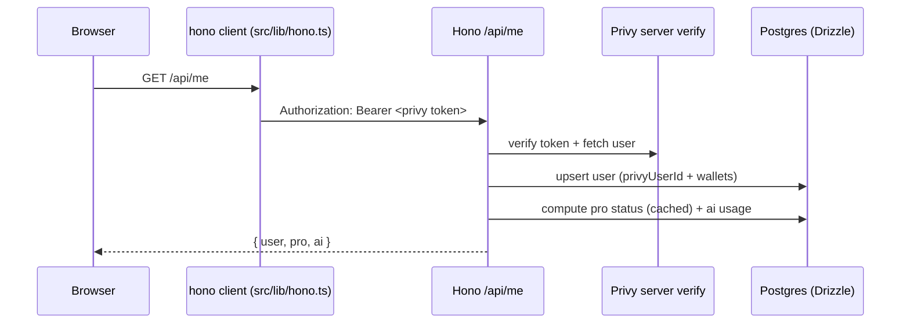
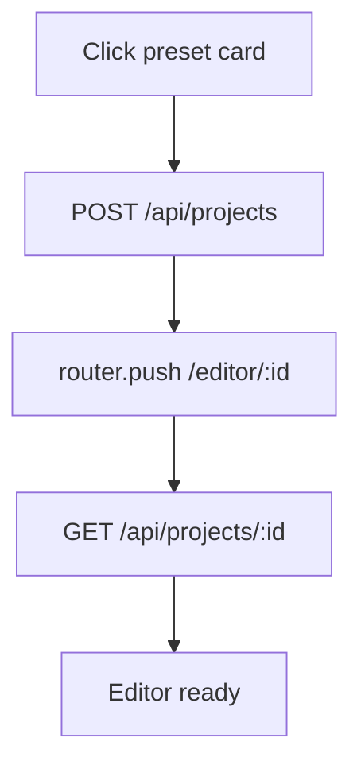
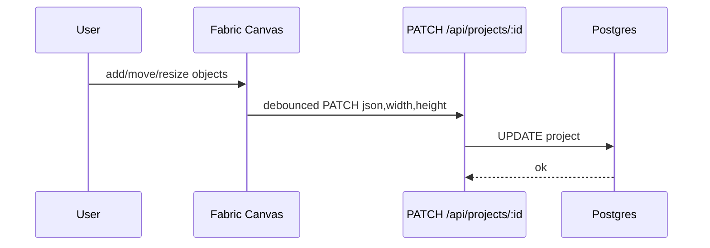

# Pigcasso Canvas — Foundamental Notes

這份文件用來幫你在「大改之前」快速掌握 repo 的架構、資料流與主要流程（以目前的 Pigcasso Canvas 版本為準）。

> Mermaid 圖若在你的 Markdown viewer 不能渲染，建議用 GitHub 預覽或在編輯器啟用 Mermaid 外掛。

## 快速開始（Local）

### 先決條件

- Bun
- Postgres（Neon / Supabase / 本機都可）

### 啟動

```bash
bun install
cp .env.example .env.local
DATABASE_URL=postgres://... bun run db:migrate
bun dev
```

打開 `http://localhost:3000`。

### 最小 `.env.local`

要跑通登入 → Dashboard → Editor，至少需要：

- `NEXT_PUBLIC_APP_URL=http://localhost:3000`
- `DATABASE_URL=postgres://...`
- `NEXT_PUBLIC_PRIVY_APP_ID=...`
- `PRIVY_APP_SECRET=...`

要啟用 Pro token gating（Mantle）：

- `MANTLE_RPC_URL=...`（Alchemy RPC URL）
- `PIGCASSO_TOKEN_ADDRESS=0xd38d6bbc92975501e6ba181262a3d3221dbbe640`
- `PIGCASSO_PRO_THRESHOLD_RAW=100000000000000000000000`

要啟用 creator hub publish（縮圖上傳）：

- `UPLOADTHING_TOKEN=...`

要啟用 AI（擇一或兩個都開）：

- `REPLICATE_API_TOKEN=...`
- `GEMINI_API_KEY=...`

---

## 系統架構（High-level）



重點：

- 前端所有 API 都走 `src/lib/hono.ts`（typed client + 自動帶 `Authorization: Bearer <privy token>`）。
- 後端驗證 Privy token 後，會把 user context 注入 Hono `Context`（`requireAuth`）。
- Pro（持幣）驗證走 Mantle RPC + ERC20 `balanceOf`，並寫回 DB 快取（避免每次都打 RPC）。

---

## Auth（Privy）

### 主要檔案

- Client provider：`src/components/providers.tsx`
- Token getter：`src/lib/auth-token.ts`
- API fetch wrapper：`src/lib/hono.ts`
- Server verify + upsert：`src/server/auth.ts`、`src/server/privy.ts`
- Hono middleware：`src/server/hono-auth.ts`

### 端到端（例：`GET /api/me`）



---

## Pro（Mantle Token Gating）

### 規則（MVP）

- Chain：Mantle Mainnet（chainId=5000）
- Token：Pigcasso `0xd38d6bbc92975501e6ba181262a3d3221dbbe640`
- decimals：18
- 門檻：`100000e18`
- Wallet 策略：embedded +（可選）external 取「最大值」（不加總）

### 工程落點

- 主要邏輯：`src/server/token-gating.ts`
- API：`GET /api/me`、`POST /api/token-gating/refresh`
- UI：`src/features/auth/hooks/use-pro.ts`、`src/features/auth/components/user-button.tsx`

---

## AI（Providers + Daily Limits）

### Providers

- Replicate：較穩定（generate / remove-bg）
- Gemini：`gemini-2.5-flash-image-preview`（更像「nano banana」的 image editing 能力）

### 用量策略（UTC day）

- 記帳 key：`privyUserId + date`
- Free：每日 5 張 generate / 5 次 remove-bg（可由 env 調整）
- Pro：預設不限（或由 env 調整）

工程檔案：

- Providers：`src/server/ai-providers.ts`
- Limits：`src/server/ai-usage.ts` + table `ai_daily_usage`
- API：`src/app/api/[[...route]]/ai.ts`
- UI：`src/features/editor/components/ai-sidebar.tsx`、`src/features/editor/components/remove-bg-sidebar.tsx`

---

## DB（Drizzle）

### Tables（MVP）

- `user`：`privyUserId`、wallets、pro cache、timestamps
- `project`：projects/templates + creator hub fields
- `ai_daily_usage`：每日 AI 計數（unique: userId+date）

Migration：

- `drizzle/0001_pigcasso_mvp.sql`（從原始 canva clone schema 過渡到 Pigcasso schema）

---

## 主要流程（你會最常動到）

### 1) 建立 Project（Dashboard Presets）

入口：`src/app/(dashboard)/presets-section.tsx`



### 2) Editor 自動存檔



### 3) Pack Export（Pro）

- UI：Editor Navbar → Export → Pack（Pro）
- 演算法：抓「可見物件 bounding box」→ 塞進每個 preset 的 safe area → 產 PNG
- ZIP：用 `jszip` 打包

核心檔案：`src/features/editor/pack-export.ts`、`src/features/editor/web3-presets.ts`

### 4) Creator Hub（Publish / Share / Remix）

- Publish：`POST /api/projects/:id/publish-template`（Editor Navbar → Publish as template）
- Browse：`GET /api/templates`（Dashboard → Browse all）
- Remix：`POST /api/templates/:id/remix`（Share page /templates/:id）

Share page：`src/app/templates/[templateId]/page.tsx`（顯示 attribution + Remix）

### 5) Pigcasso Assistant（Chat + Actions）

- UI：Editor 右下角浮動 panel
- 行為：置中 / 字級層級 / AMA layout / 3 variants（centered/split/diagonal）
- 需要明確按 Apply 才會改畫布（避免誤觸）

檔案：

- UI：`src/features/editor/components/pigcasso-assistant.tsx`
- Actions：`src/features/editor/pigcasso-actions.ts`
