# The Canvas — Foundamental Notes

這份文件把先前散在 `docs/` 的學習筆記整併成單一檔案，方便你在「大改之前」快速掌握架構、資料流與關鍵流程。

> Mermaid 圖若在你的 Markdown viewer 不能渲染，建議用 GitHub 預覽或在編輯器啟用 Mermaid 外掛。

## 快速導航

- 先把專案跑起來：看「本機啟動與環境」
- 想理解整體怎麼串：看「系統架構」與「端到端流程」
- 想開始加功能：看「模組邊界」與各領域章節（Auth / API / DB / Editor / Subscriptions）

---

## 本機啟動與環境

### 先決條件

- Node.js 18+（或直接用 Bun）
- Postgres（Neon / Supabase / 本機 Docker 都可）

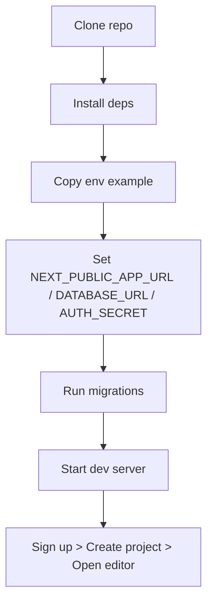

### 安裝與啟動

```bash
bun install
cp .env.example .env.local
bun dev
```

打開 `http://localhost:3000`。

> Repo 同時有 `bun.lockb` 與 `package-lock.json`；建議優先用 Bun，避免 lockfile 漂移造成依賴不一致。

### 最小 `.env.local`

要跑通基本流程（註冊 → 登入 → Dashboard → Editor），至少需要：

- `NEXT_PUBLIC_APP_URL=http://localhost:3000`（前端 Hono typed client base URL）
- `DATABASE_URL=postgres://...`（Drizzle/NextAuth 會用到）
- `AUTH_SECRET=...`（Auth.js/NextAuth）

其他整合功能再補：

- Unsplash：`NEXT_PUBLIC_UNSPLASH_ACCESS_KEY`
- UploadThing：`UPLOADTHING_SECRET`、`UPLOADTHING_APP_ID`
- Replicate：`REPLICATE_API_TOKEN`
- OAuth：`AUTH_GITHUB_ID/SECRET`、`AUTH_GOOGLE_ID/SECRET`
- Stripe：`STRIPE_SECRET_KEY`、`STRIPE_PRICE_ID`、`STRIPE_WEBHOOK_SECRET`

### DB / Migrations（Drizzle）

```bash
bun run db:generate
bun run db:migrate
bun run db:studio
```

### Template seed（常用）

模板其實是 DB 的 `project` 記錄，只是 `isTemplate=true`（另可用 `isPro=true` 走 paywall）。最簡單用 `bun run db:studio` 直接改 `project` 表。

---

## 系統架構

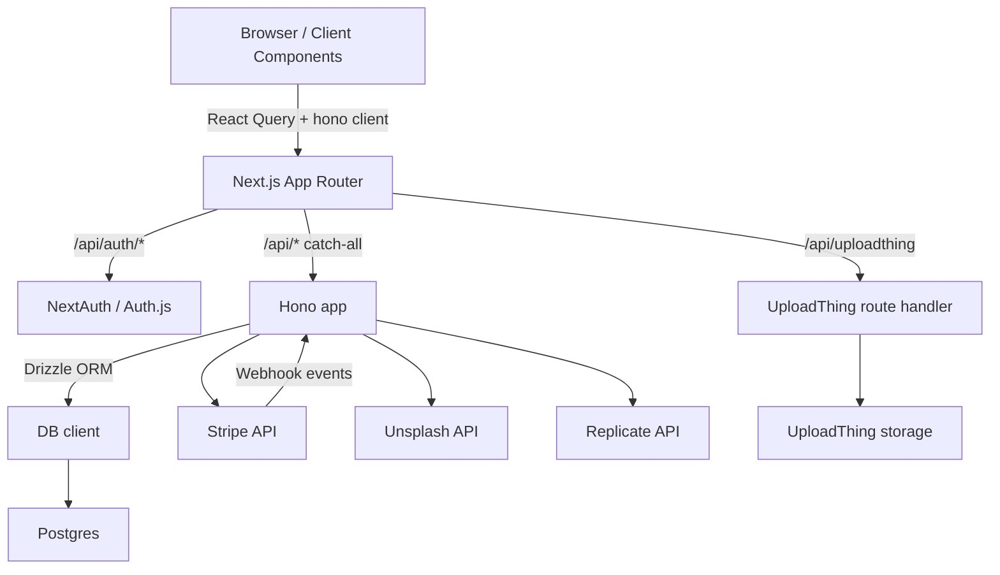

### 專案結構（你會常逛的目錄）

- `src/app/`：Next.js App Router pages/layouts（含 route groups：`(auth)`、`(dashboard)`）
- `src/app/api/`：API routes
  - NextAuth：`src/app/api/auth/[...nextauth]/route.ts`
  - UploadThing：`src/app/api/uploadthing/*`
  - Hono catch-all：`src/app/api/[[...route]]/*`
- `src/features/`：以 domain 分組的 UI + hooks + API client（`auth`/`projects`/`editor`/`subscriptions`…）
- `src/db/`：Drizzle schema + DB client
- `drizzle/`：SQL migrations
- `src/lib/`：整合第三方 SDK（Stripe/Replicate/Unsplash）+ `hono` client

### Client / Server 邊界（debug 重要）

- `src/app/layout.tsx` 是 Server Component：會 `await auth()` 後把 session 交給 `SessionProvider`
- Dashboard 頁面保護在 server 做：`src/features/auth/utils.ts` 的 `protectServer()`
- Editor 頁面是 client：`src/app/editor/[projectId]/page.tsx`，用 React Query 在瀏覽器呼叫 API

### 例：讀取單一 Project 的完整鏈路

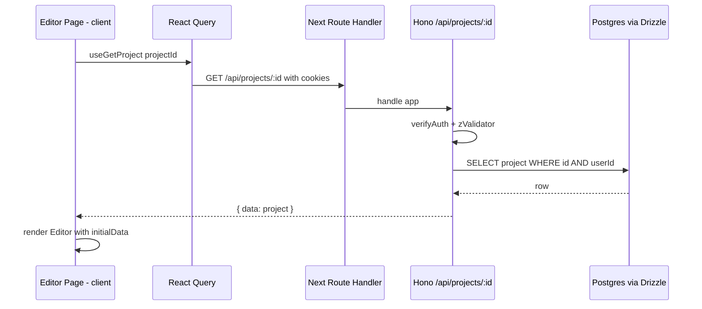

---

## 端到端流程（你會最常動到的）

### 建立空白 Project（Dashboard Banner）

入口：`src/app/(dashboard)/banner.tsx`

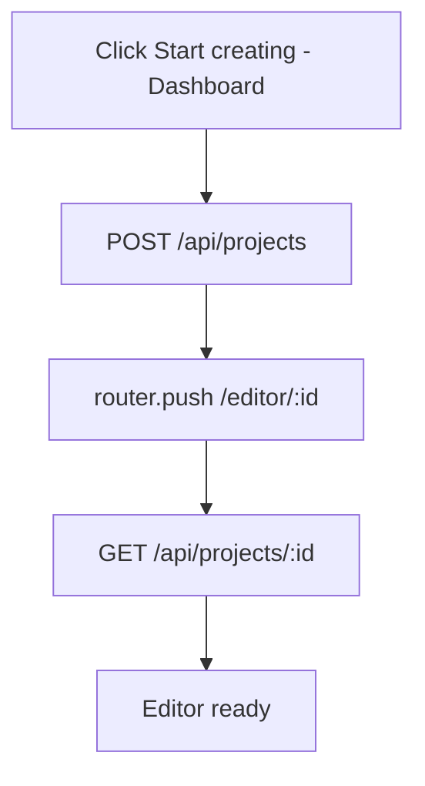

### Editor 自動存檔（擴充時最常踩到）

入口：`src/features/editor/components/editor.tsx` + `src/features/editor/hooks/use-history.ts`

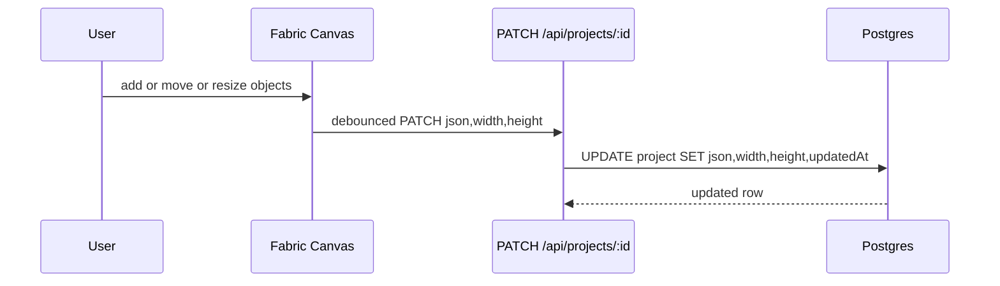

含意：

- 任何觸發 `object:added/removed/modified` 的操作都可能寫 DB（含 undo/redo）
- 想保存自訂 metadata，記得把 key 加進 `JSON_KEYS`（見下方 Editor 章）

### 從 Template 建 Project（含 Paywall）

入口：`src/app/(dashboard)/templates-section.tsx`

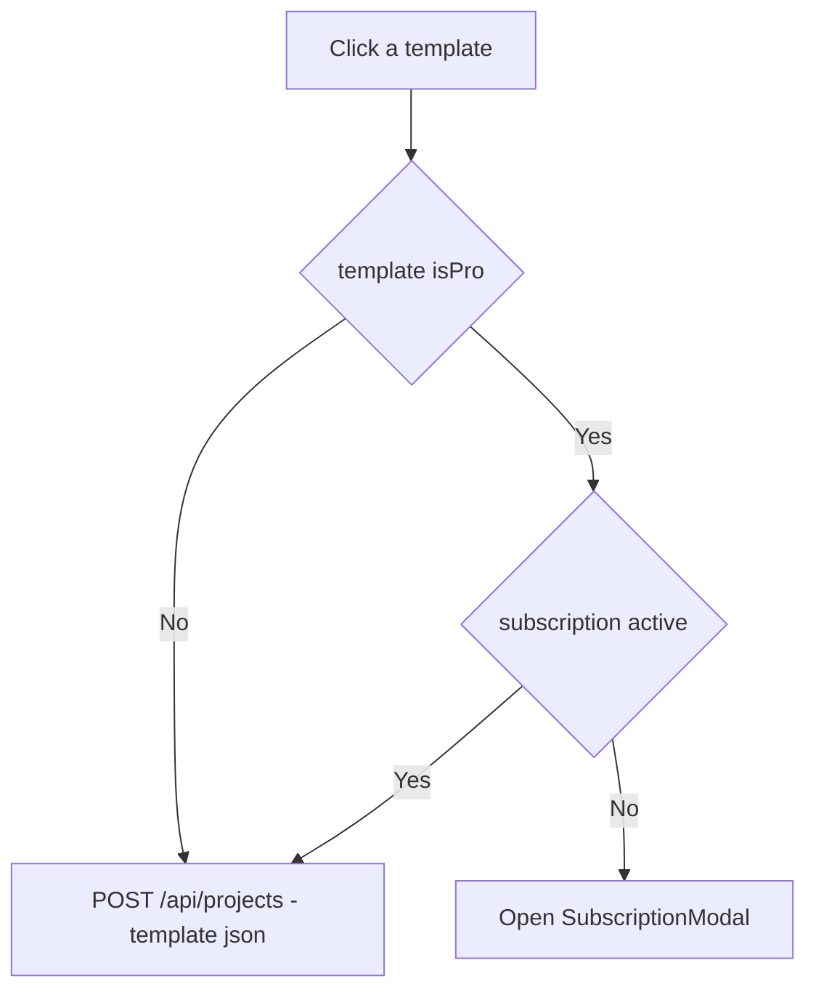

---

## Auth（NextAuth v5 / Auth.js）與權限保護

### 相關檔案

- 設定：`src/auth.config.ts`（providers、adapter、callbacks）
- 匯出：`src/auth.ts`（`auth()` / handlers）
- NextAuth route：`src/app/api/auth/[...nextauth]/route.ts`
- 頁面保護：`src/features/auth/utils.ts`（`protectServer()`）
- Hono API 驗證：`src/app/api/[[...route]]/route.ts` + 各 router 的 `verifyAuth()`

### 註冊（Credentials）流程

這個 repo 的註冊不是 NextAuth 內建 UI 流程，而是先建立 user，再立刻用 credentials 登入。

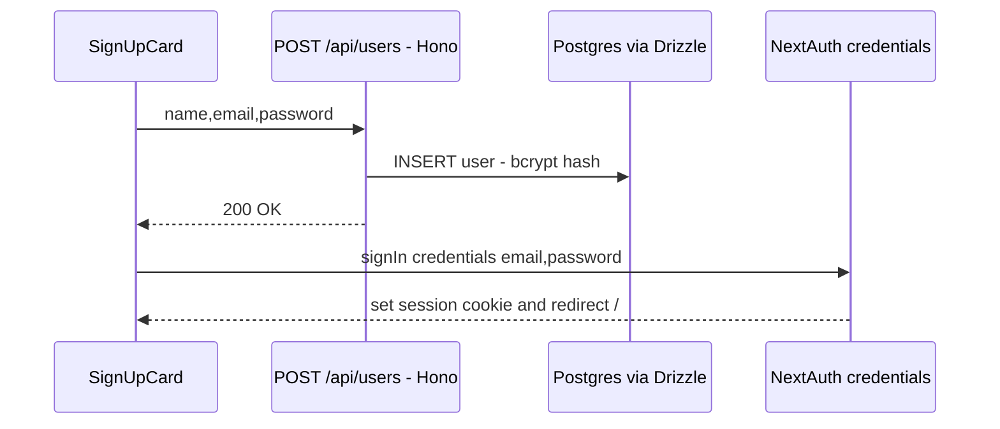

### 保護頁面 vs 保護 API

- 頁面：Dashboard 在 server 端 `protectServer()`，沒 session 就 redirect
- API：Hono endpoints 多用 `verifyAuth()`，再用 `authUser.token.id` 做資料隔離（只動自己的 rows）

---

## API（Hono）與前端呼叫

### 先釐清：這個 repo 有 3 種 API route

- NextAuth：`/api/auth/*` → `src/app/api/auth/[...nextauth]/route.ts`
- UploadThing：`/api/uploadthing` → `src/app/api/uploadthing/route.ts`
- Hono catch-all：其餘 `/api/*` → `src/app/api/[[...route]]/route.ts`

### Hono router 掛載

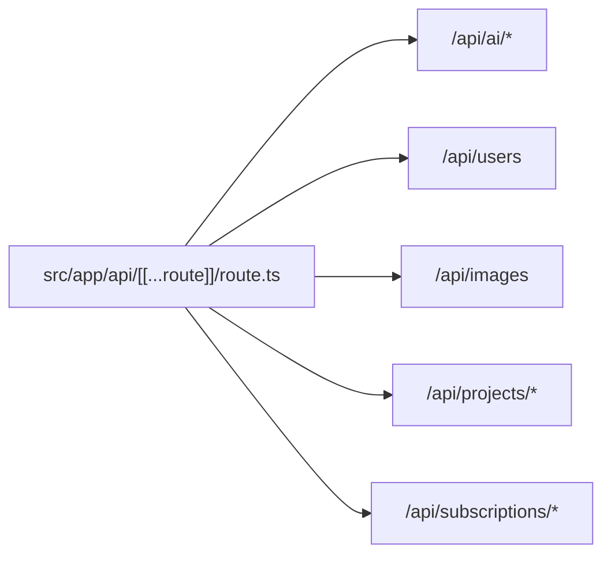

### 前端怎麼呼叫（Typed）

client 定義在 `src/lib/hono.ts`：

```ts
export const client = hc<AppType>(process.env.NEXT_PUBLIC_APP_URL!);
```

所以 `NEXT_PUBLIC_APP_URL` 一旦沒設或設錯，瀏覽器端呼叫會直接壞掉。

### 典型請求流程

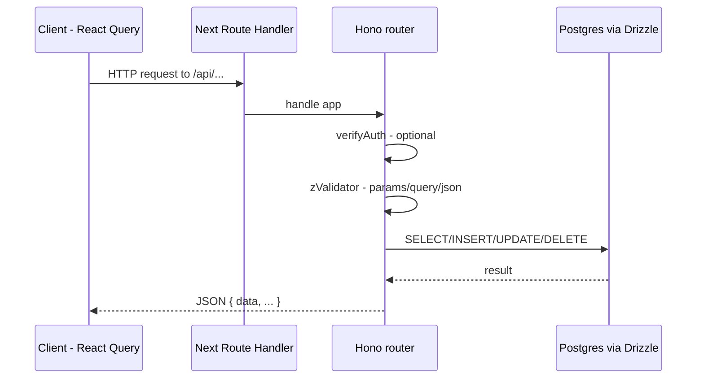

### 目前 endpoints（快速對照）

- `POST /api/users`：註冊
- `GET /api/projects`：我的 projects（分頁）
- `POST /api/projects`：建立 project
- `GET /api/projects/:id`：取得單一 project
- `PATCH /api/projects/:id`：更新 project（Editor 自動存檔）
- `DELETE /api/projects/:id`：刪除 project
- `POST /api/projects/:id/duplicate`：複製 project
- `GET /api/projects/templates`：模板（`isTemplate=true`）
- `GET /api/images`：Unsplash 隨機圖
- `POST /api/ai/generate-image`：Replicate 生成圖
- `POST /api/ai/remove-bg`：Replicate 去背
- `GET /api/subscriptions/current`：訂閱狀態（含 `active`）
- `POST /api/subscriptions/checkout`：Stripe Checkout
- `POST /api/subscriptions/billing`：Stripe Billing Portal
- `POST /api/subscriptions/webhook`：Stripe webhook

### 新增 endpoint 的建議切法

- Server router：`src/app/api/[[...route]]/<domain>.ts`
- Client hooks：`src/features/<domain>/api/use-*.ts`

---

## Database（Drizzle + Postgres）

### 入口與 migrations

- Schema：`src/db/schema.ts`
- DB client：`src/db/drizzle.ts`
- Drizzle config：`drizzle.config.ts`（讀 `.env.local`）
- Migrations：`drizzle/*.sql` + `drizzle/meta/`

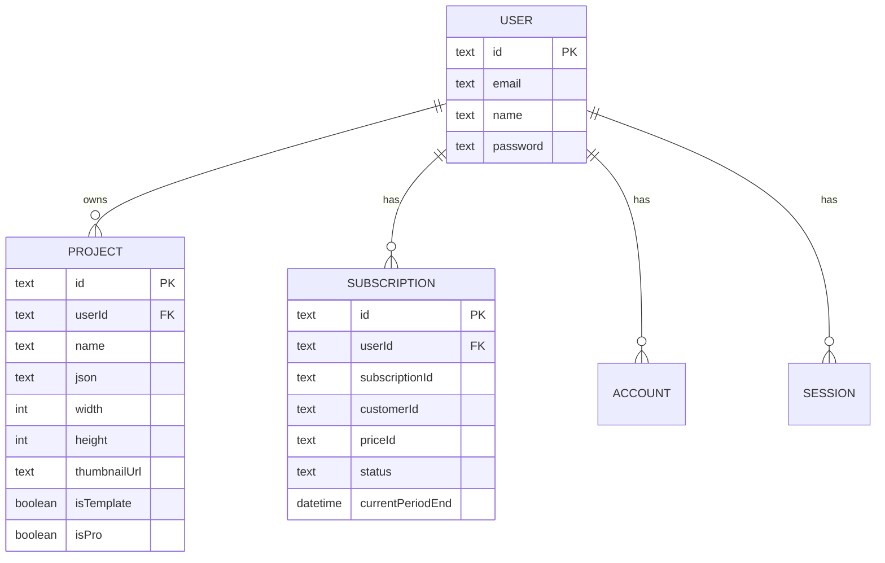

### 改 schema 的安全流程

1. 改 `src/db/schema.ts`
2. `bun run db:generate` 產生 migration
3. 檢查 `drizzle/*.sql`
4. `bun run db:migrate` 套用

---

## Editor（Fabric.js）

### 你需要理解的核心檔案

- UI 容器：`src/features/editor/components/editor.tsx`
- 核心狀態與操作 API：`src/features/editor/hooks/use-editor.ts`
- 事件綁定：`src/features/editor/hooks/use-canvas-events.ts`
- Undo/Redo 與持久化：`src/features/editor/hooks/use-history.ts`
- 自動縮放：`src/features/editor/hooks/use-auto-resize.ts`
- Tool 定義：`src/features/editor/types.ts`

### 初始化流程

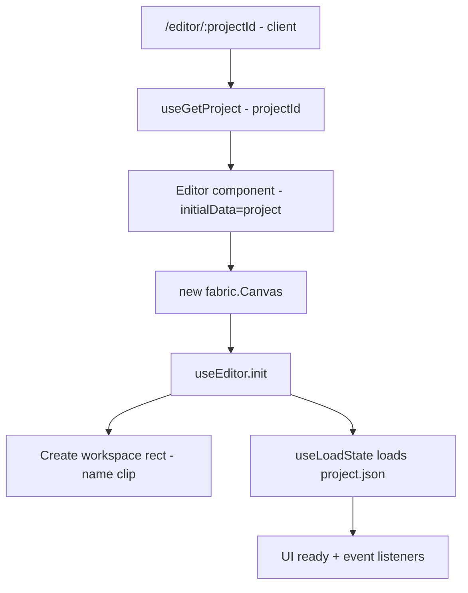

### Workspace / Clip

`useEditor().init()` 會建立 `name="clip"` 的 `fabric.Rect`：

- 作為工作區尺寸來源（對應 DB `project.width/height`）
- 也用作 `canvas.clipPath`，因此匯出只會包含工作區範圍

### JSON 持久化與 `JSON_KEYS`

Fabric `toJSON()` 不會自動保存你所有自訂欄位；這個 repo 用 `JSON_KEYS` 控制額外保留哪些 key（`src/features/editor/types.ts`）。

若你要在物件上保存自訂 metadata（例如 link、tag、lock），通常需要：

1. `object.set({ yourKey: yourValue })`
2. 在 `JSON_KEYS` 加上 `"yourKey"`
3. 確認 `loadFromJSON` 後仍能讀到該欄位

### 加一個新工具（建議步驟）

1. 在 `ActiveTool` 加新字串（`src/features/editor/types.ts`）
2. 在 Editor sidebar 增加入口（`src/features/editor/components/sidebar.tsx`）
3. 新增或擴充對應 `*-sidebar.tsx`
4. 若需要新 canvas 操作，優先加到 `buildEditor()` 回傳的 `editor` 物件

---

## 訂閱 / Paywall（Stripe）

### Paywall 判斷（前端）

`usePaywall()` 會呼叫 `GET /api/subscriptions/current`，用 `active` 決定要不要擋。

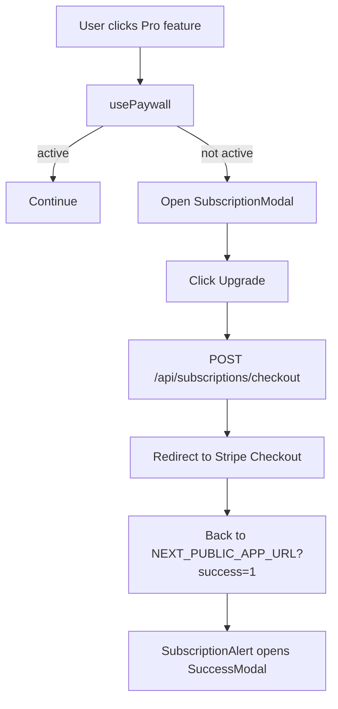

### Stripe 端到端

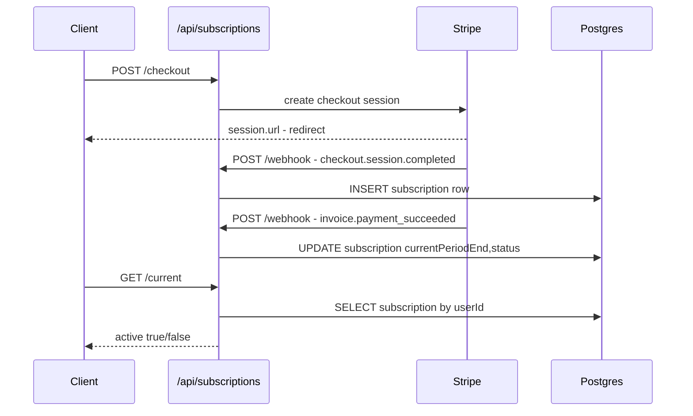

### Billing Portal

已訂閱使用者點 Dashboard 側欄 Billing：`POST /api/subscriptions/billing` → 拿到 portal URL → 導頁。

---

## Troubleshooting（快速排查）

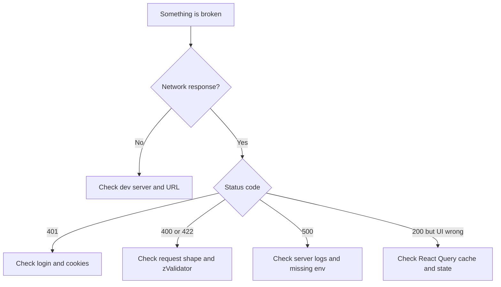

常見坑：

- 全部前端 API 都失敗：多半是 `NEXT_PUBLIC_APP_URL` 沒設或不是 `http://localhost:3000`
- zsh 路徑含 `[[...route]]` 或 `(auth)`：用單引號包起來，例如 `sed -n '1,60p' 'src/app/api/[[...route]]/route.ts'`

---

## Pigcasso Canvas 方向（摘要）

> 你 fork 之後真正要做的產品規格，完整版本看 `PRD.md`。這裡只放「為什麼要做」與「改造時的主軸」，方便你在讀原始碼時不迷路。

- 定位：不是做另一個 Canva，而是做「Web3 社群的設計助理 + 多尺寸素材管線」。
- 差異化槓桿（用現成地基往上疊）：
  - 保留 Fabric.js editor 的可編輯性（最後 20% 排版/可讀性/安全區）
  - 用 token gating 取代 Stripe 訂閱（Mantle + Pigcasso token）
  - 右下角 Pigcasso Assistant：聊天指令 → 可落地的 canvas actions（置中、對齊、AMA 版型、variants）
  - Pack export：同一份設計一鍵輸出多平台尺寸
  - Creator Hub seed：publish/share/remix + attribution（先不做 marketplace/分潤）

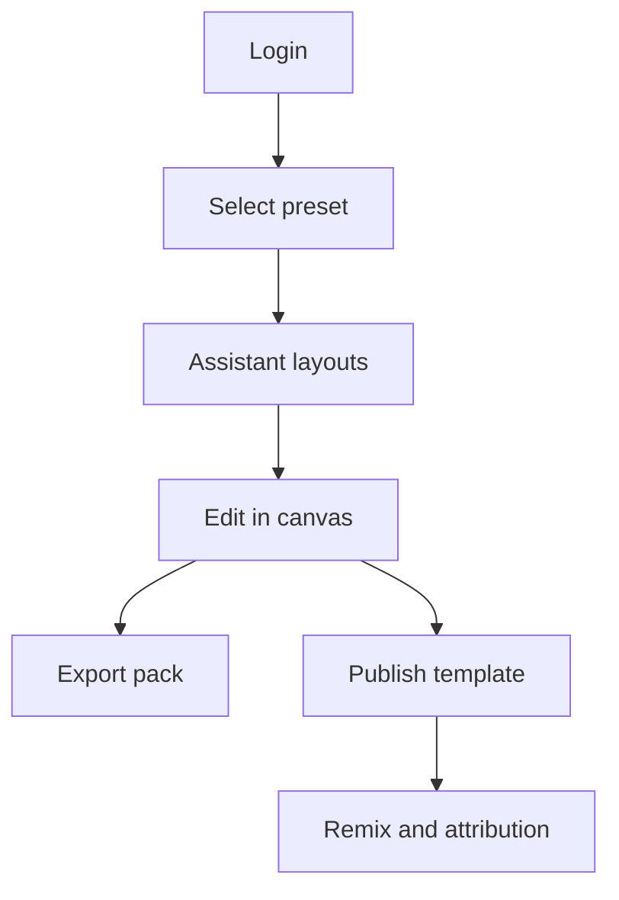
